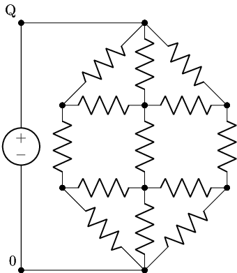
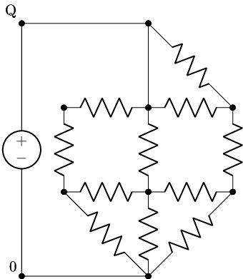

# Shannon's Bird Cage

A connection game, also known as Bridg-It, or the Shannon Switching Game.

## Introduction

Quoting from "Hex: The Full Story" by Ryan B. Hayward (p119):

> The Shannon switching game is played on a graph with two special nodes. One player is Cut, the other Short. On her turn, Cut breaks (or erases) any unmarked link. On his turn, Short marks any unbroken link. The game ends either when the two special nodes are joined by a path of marked links - so Short wins - or the special nodes have been separated into different components - so Cut wins.

Bird Cage is the Shannon Switching Game played on a graph that looks like a bird cage. The two special nodes are marked 0 and Q.



It is drawn as an electrical circuit, since Shannon built a machine using resistors to play Bird Cage.

Imagine that Cut removes the resistor at top left, then Short replaces the resistor at top centre with a wire. The resulting position is then



Play continues until there is a short circuit (Short wins), or the circuit is such that zero current flows (Cut wins).

## Shannon's Heuristic

Shannon's machine plays as Cut, and simply selects the resistor that has the largest current flow. (Equivalently, since all the resistors are the same, select the resistor with the largest voltage drop across it.)

His machine was for the M=4 version of the game, which is 4 links wide. (Rather than 3 shown above.)

This simple heuristic plays a good game. According to Shannon (reported by Martin Gardner in "More Mathematical Puzzles and Diversions"):

> Out of hundreds of games played, the machine has had only two losses when it had the first move, and they may have been due to circuit failure or improper playing of the game.

However, it is possible to always beat the machine (M=3 or 4), as shown by Thomas Fisher in ["Bridg-It – Beating Shannon’s Analog Heuristic"](https://www.minet.uni-jena.de//math-net/reports/sources/2009/09-07report.pdf).

## Software implementation

I have written two software implementations of the game. The first is a Python implementation that uses [Lcapy](https://lcapy.readthedocs.io/en/latest/) to run a circuit simulation of the resistor network so it can implement a strategy for
Shannon's Heuristic. The second is a virtual circuit for [CircuitJS1](https://github.com/pfalstad/circuitjs1), an electronic circuit simulator that runs in the browser.

### Python

The Python implementation has a command line program that allows you to play against Shannon (or his heuristic at least).

You run it you will need Python 3 on your computer.

Create a virtual env, and install the required packages:

```bash
conda create --name birdcage python=3.9
conda activate birdcage
pip install -r requirements.txt
```

To run the program type

```bash
python play.py 3
```

The board will appear and Shannon will make the first move:

```
Shannon (W) - Human (B)
    ● = ● = ●
5   |   |   |
4   ● - ● - ●
3   |   |   |
2   ● - ● - ●
1       |   |
    ● = ● = ●
    A B C D E
A1
```

Move the cursor to the position where you want to SHORT the circuit then press enter. Continue until there is a winner!

To play the M=4 game type

```bash
python play.py 4
```

There is a [notebook](beating-shannon-m3.ipynb) that explores how to beat Shannon's Heuristic for M=3. There is also a short [animation](https://asciinema.org/a/RpoRHCJVsdKiEexn4JgtQ13sz) of a game showing these moves. You can look at the unit tests for moves to beat it for M=4.

### CircuitJS1

## Hardware implementation

In a real implementation a couple of practical changes are needed.

First, a resistor should be added in series to the whole circuit, to avoid a real short circuit in the event of Short winning.

Second, it's possible that a part of the circuit can become isolated from both the ground and positive power supply, which means that all nodes in it have a floating voltage. Since voltage differences are used to determine the next move, we use pull-up resistors to ensure that spurious voltage differences are not recorded. By using pull-up resistors with much larger resistance than the ones used in the main circuit, we avoid changing the behaviour of the
heuristic in any significant way. (In a real circuit, small differences in resistor values mean that the machine may not play identically to the theoretical version, but this is rare, and it usually doesn't make much difference.)
