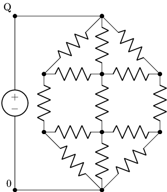
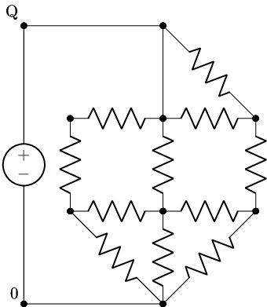
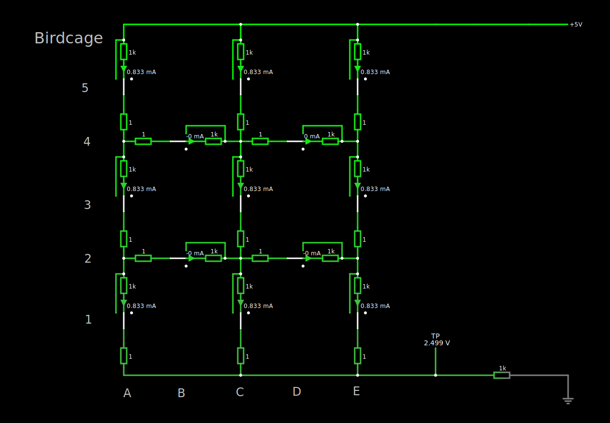
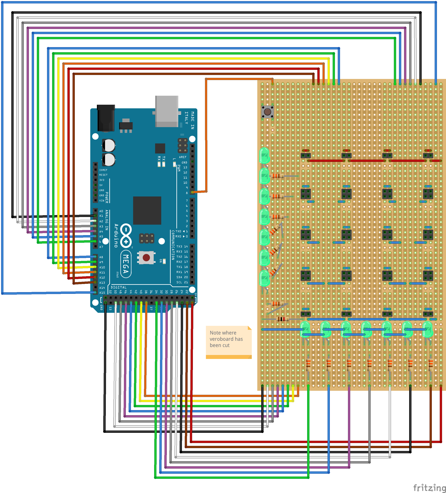
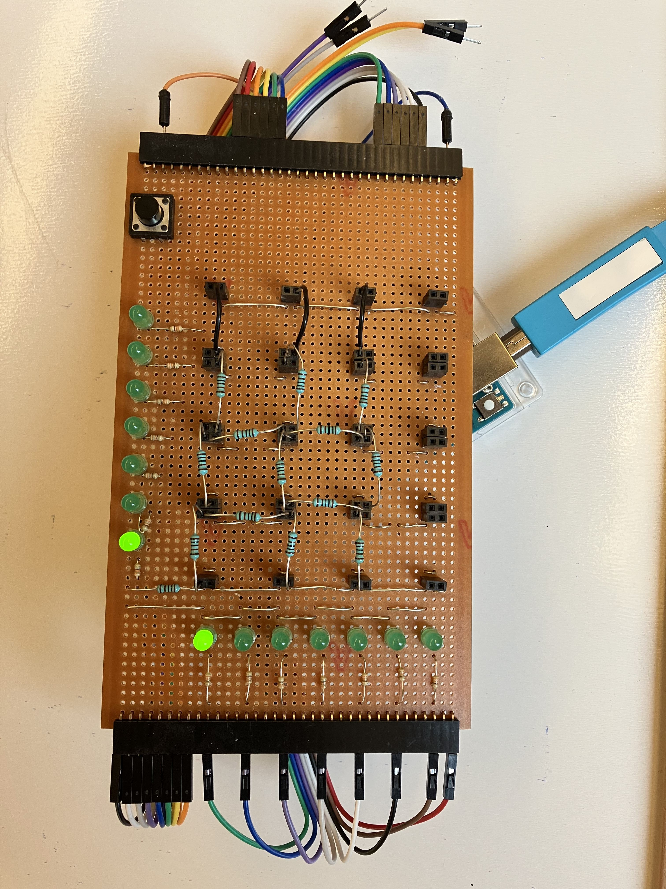
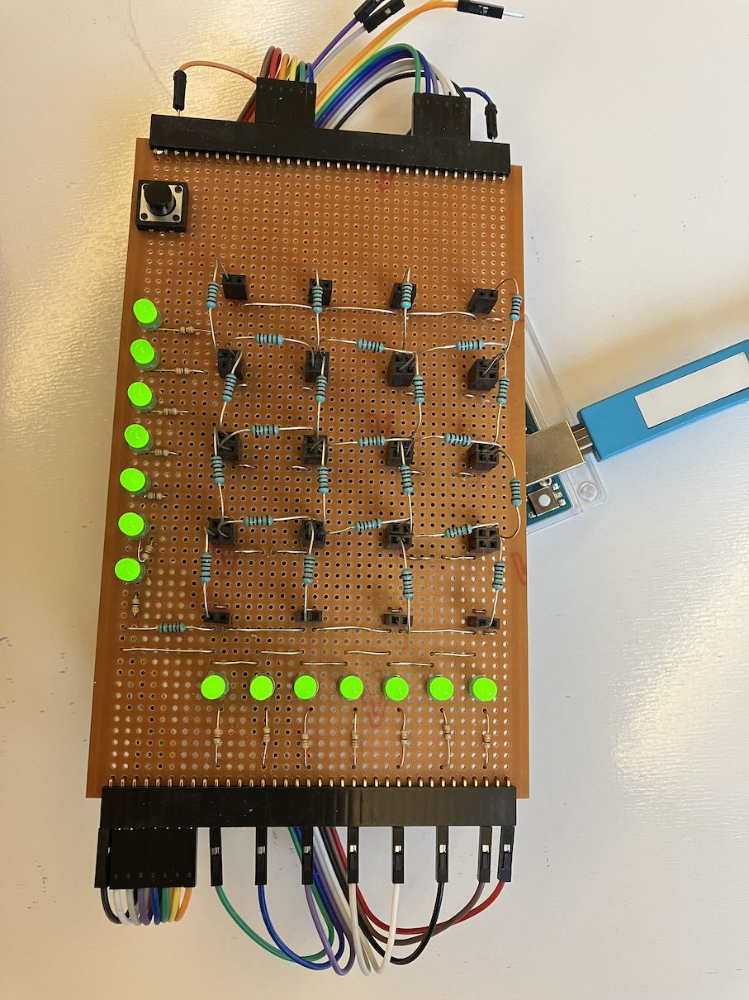

# Shannon's Bird Cage

A connection game, also known as Bridg-It, or the Shannon Switching Game.

> It is also curious that the Hex-player reversed the usual computing procedure in that it solved a basically digital problem by an analog machine. -- _Claude E. Shannon,_ Computers and automata, _1953_

The MIT museum has a [photo of the game](https://webmuseum.mit.edu/detail.php?term=Shannon&module=objects&type=keyword&x=0&y=0&kv=75604&record=16&page=1) that Shannon built in the 1950s.

## Introduction

Quoting from "Hex: The Full Story" by Ryan B. Hayward (p119):

> The Shannon switching game is played on a graph with two special nodes. One player is Cut, the other Short. On her turn, Cut breaks (or erases) any unmarked link. On his turn, Short marks any unbroken link. The game ends either when the two special nodes are joined by a path of marked links - so Short wins - or the special nodes have been separated into different components - so Cut wins.

Bird Cage is the Shannon Switching Game played on a graph that looks like a bird cage. The two special nodes are marked 0 and Q.



It is drawn as an electrical circuit, since Shannon built a machine using resistors to play Bird Cage.

Imagine that Cut removes the resistor at top left, then Short replaces the resistor at top centre with a wire. The resulting position is then



Play continues until there is a short circuit (Short wins), or the circuit is such that zero current flows (Cut wins).

## Shannon's Heuristic

Shannon's machine plays as Cut, and simply selects the resistor that has the largest current flow. (Equivalently, since all the resistors are the same, select the resistor with the largest voltage drop across it.)

His machine was for the M=4 version of the game, which is 4 links wide. (Rather than 3 shown above.)

This simple heuristic plays a good game. According to Shannon (reported by Martin Gardner in "More Mathematical Puzzles and Diversions"):

> Out of hundreds of games played, the machine has had only two losses when it had the first move, and they may have been due to circuit failure or improper playing of the game.

However, it is possible to always beat the machine (M=3 or 4), as shown by Thomas Fisher in ["Bridg-It – Beating Shannon’s Analog Heuristic"](https://www.minet.uni-jena.de//math-net/reports/sources/2009/09-07report.pdf).

## Real-world considerations

In a real implementation a couple of practical changes are needed.

First, a resistor should be added in series to the whole circuit, to avoid a real short circuit in the event of Short winning.

Second, it's possible that a part of the circuit can become isolated from both the ground and positive power supply, which means that all nodes in it have a floating voltage. Since voltage differences are used to determine the next move, we use pull-up resistors to ensure that spurious voltage differences are not recorded. By using pull-up resistors with much larger resistance than the ones used in the main circuit, we avoid changing the behaviour of the
heuristic in any significant way. (In a real circuit, small differences in resistor values mean that the machine may not play identically to the theoretical version, but this is rare, and it usually doesn't make much difference.)

## Software implementation

I have written two software implementations of the game. The first is a Python implementation that uses [Lcapy](https://lcapy.readthedocs.io/en/latest/) to run a circuit simulation of the resistor network so it can implement a strategy for
Shannon's Heuristic. The second is a virtual circuit for [CircuitJS1](https://github.com/pfalstad/circuitjs1), an electronic circuit simulator that runs in the browser.

### Python

The Python implementation has a command line program that allows you to play against Shannon (or his heuristic at least).

You run it you will need Python 3 on your computer.

Create a virtual env, and install the required packages:

```bash
conda create --name birdcage python=3.9
conda activate birdcage
pip install -r requirements.txt
```

To run the program type

```bash
python play.py 3
```

The board will appear and Shannon will make the first move:

```
Shannon (W) - Human (B)
    ● = ● = ●
5   |   |   |
4   ● - ● - ●
3   |   |   |
2   ● - ● - ●
1       |   |
    ● = ● = ●
    A B C D E
A1
```

Move the cursor to the position where you want to SHORT the circuit then press enter. Continue until there is a winner!

To play the M=4 game type

```bash
python play.py 4
```

There is a [notebook](beating-shannon-m3.ipynb) that explores how to beat Shannon's Heuristic for M=3. There is also a short [animation](https://asciinema.org/a/RpoRHCJVsdKiEexn4JgtQ13sz) of a game showing these moves. You can look at the unit tests for moves to beat it for M=4.

### CircuitJS1

CircuitJS1 simulates electronic circuits and runs in the browser. Steps to run it:

- Download [birdcage-size3.circuitjs.txt](circuitjs/birdcage-size3.circuitjs.txt) for the M=3 game, or [birdcage-size4.circuitjs.txt](circuitjs/birdcage-size4.circuitjs.txt) for the M=4 game.
- Open the [full screen version of CircuitJS1](http://falstad.com/circuit/circuitjs.html).
- Select File | Open File... in the menu, and choose the `circuitjs.txt` file you downloaded.

You should see a screen that looks like the following:



To play the game you operate the white switches to choose between CUT and SHORT. Initially all switches are in the middle position, so the current flows through the connected resistor. There is an ammeter next to each resistor showing the current flowing through it.

So to use Shannon's Heuristic you find the ammeter with the largest (absolute) current flow, and then move the switch to the disconnected (CUT) position. SHORT then moves by moving a switch to the shorted position. (Once a switch has been moved the ammeter will show zero, and obviously it should not be moved again to comply with the rules of the game.)

If CUT has won then the Test Point at the lower right shows 0V.

If SHORT has won then the Test Point shows 5V (give or take, due to the extra resistor that prevents the short circuit causing infinite current flow).

Note that pull-up resistors have not been included in these simulations, so there are some game positions that may cause an error in the simulator.

## Hardware implementation

While it is easy to create a resistor network, it is difficult to measure the current flowing through each resistor in the network (in a cost-effective way, at least), which is what we need to use Shannon's Heuristic. Shannon apparently used a bulb in series with each resistor, and then used the brightness as a proxy for current flow, but this seems like it would be difficult to judge, particularly since current flows can be very similar in practice. Gardner (1961) says that Shannon built a second version with "neon lamps and a network that permitted only one lamp to go on".

In my implementation I cheated and used an Arduino to measure the voltage at each point in the network. An Arduino analog pin has an analog-to-digital converter with a granularity of 1024 voltage levels, which is more than adequate to play this game.

For a board of size M, we need to measure M(M-1) + 1 voltage levels. (The last "+ 1" is to detect the winner, described below.) So for M=4 we need 13 analog pins. The Arduino UNO only has 6 analog pins, so my first thought was to use a multiplexer to switch the 13 analog inputs to a smaller number of analog pins on the Arduino. However, controlling the multiplexer uses digital pins, and since the UNO has 14 of these and there are also 14 LEDs to control, I opted for an Arduino Mega (which has more than enough pins) so I didn't have to multiplex the outputs too.

The wiring I used for the birdcage resistor network was very low-tech: each node in the network is a cluster of PCB header sockets connected together that are used to connect one node to another with a resistor, a wire, or nothing at all - corresponding to the initial position, SHORT, and CUT, respectively. Playing the game is then a matter of plugging or unplugging wires and resistors in the sockets, which is a bit fiddly, but very "direct". A more polished game would use rotary switches for each node (3 position, 45 degrees), but this would add to the cost quite significantly.

I used a large veroboard for the circuit. This worked very well, but required a lot of breaks in the tracks, using a special track cutter.

Shannon (CUT) indicates the next move via two banks of 7 LEDs. One bank indicates the row and the other the column of the resistor to remove.

Play continues until there is a winner. This is detected by measuring the voltage of the bottom row of nodes. If it is 0V then CUT has won, but if it is 5V then SHORT has won. Note that the pull-up resistors need to be disconnected (in Arduino code) before measuring this voltage.

### Playing the game

The machine plays CUT using Shannon's heuristic by _removing_ resistors. You play SHORT by _replacing_ resistors with wires.

You can play on a board of size 3 or 4 - this is detected at the start by seeing if the top row has jumpers to the second row (M=3) or resistors (M=4). (This is illustrated in the photos below.)

1. Connect all the nodes together with the resistors in the birdcage pattern.
2. Turn on the power, or press the Arduino's reset button, and all LEDs will light up indicating that it's a new game.
3. Press the button once. Two LEDs will light up indicating Shannon's move (CUT). Remove the resistor at that position.
4. Make your move by replacing a resistor with a piece of wire (SHORT).
5. Go to step 3. and repeat. When the game is over, either all of the LEDs in a vertical line will light up, indicating Shannon (CUT) has won, or all of the horizontal LEDs will light up showing you (SHORT) have won.

Have a look at this [video](images/arduino.mov) to see it in action.

### Parts list

- 1x Arduino Mega 2560 Rev3 and power supply
- 1x Momentary Push Button Switch - 12mm Square (e.g. Proto-PIC PPCOM-09190)
- 14x Green LED - 5mm
- 14x Resistor, 330Ω
- 30x Resistor, 1kΩ, 1%
- 1x Veroboard 100mm x 160mm (e.g. CPC Farnell 09-2196L)
- 16x Vertical PCB Header Socket, 2.54mm 2 Way 1 Row (e.g. CPC Farnell M20-9820206)
- 2x 0.1" 36-pin Strip Right-Angle Female/Socket Header
- 2x Male/Male Jumper Wires - 20 x 6" (150mm) (e.g. The Pi Hut 103192)
- Solid core wire
- Solder
- Veroboard track cutter

### Wiring

Here's the veroboard wiring diagram:



### Code

[birdcage.ino](arduino/birdcage.ino)

### Photos

At the start of an M=3 game. Shannon has made the first move (A1):



At the start of an M=4 game. No moves have been made yet as all LEDs are on:



## References

- Fisher, Thomas, (2009), [_Bridg-It – Beating Shannon’s Analog Heuristic_](<(https://www.minet.uni-jena.de//math-net/reports/sources/2009/09-07report.pdf)>)
- Gardner, Martin, (1961), **More Mathematical Puzzles and Diversions**, Penguin Books
- Hayward, Ryan B., with Toft, Bjarne, (2019) **Hex: The Full Story**, CRC Press
